# Architecture Overview

This page is the system design reference for quillmark-mcp. It covers the data flow from MCP client to rendered artifact, the stateless HTTP pattern, transport selection, the Ollama sidecar, and the package exports map.

---

## Data flow

```mermaid
flowchart LR
    Client["MCP Client<br/>(Claude Code, Cursor, etc.)"]
    Adapter["McpSdkServerAdapter<br/>src/mcp/McpSdkServerAdapter.js"]
    QM["QuillmarkMCP<br/>src/mcp/QuillmarkMCP.js"]
    Primitives["Primitives<br/>listQuills / getSpecs / createDocument"]
    Registry["QuillRegistry<br/>@quillmark/registry"]
    Engine["Quillmark WASM<br/>@quillmark/wasm"]
    Strategy["RenderAndHostStrategy<br/>src/strategies/RenderAndHostStrategy.js"]
    Artifact["Artifact<br/>PDF / SVG / TXT on disk"]

    Client -- "JSON-RPC 2.0<br/>(stdio or Streamable HTTP)" --> Adapter
    Adapter -- "registers tools on" --> QM
    QM -- "delegates to" --> Primitives
    Primitives -- "resolve quill" --> Registry
    Registry -- "parse + render" --> Engine
    Primitives -- "strategy.handle()" --> Strategy
    Strategy -- "WASM render + writeFile" --> Artifact
```



### Request lifecycle (concrete example)

1. Claude Code sends `tools/call create_document` over stdio or HTTP.
2. `McpSdkServerAdapter` routes the request to the registered tool handler.
3. `QuillmarkMCP` delegates to the `createDocument` primitive.
4. `createDocument` validates YAML frontmatter, resolves the quill via the registry, dry-renders to catch schema errors, then calls `strategy.handle(quill, content)`.
5. `RenderAndHostStrategy.handle` runs `Quillmark.parseMarkdown` + `engine.render`, writes bytes to `outputDir`, returns `{ status: 'success', url }`.
6. The URL bubbles back through the primitive, through the MCP tool response, to the client.

---

## Component table

| Component | File | Role |
|---|---|---|
| **bin.js** | `src/bin.js` | CLI entry point. Parses flags/env vars, dispatches to `config` subcommand or starts the MCP server. Injects the strategy and calls `createDefaultMCP`. |
| **McpSdkServerAdapter** | `src/mcp/McpSdkServerAdapter.js` | Transport adapter. Routes HTTP requests to per-request `McpServer` instances, serves artifact files, handles stdio dispatch, returns JSON 404 on unknown paths. The most architecturally important file in the MCP layer. |
| **QuillmarkMCP** | `src/mcp/QuillmarkMCP.js` | Glue layer. Validates injected dependencies, registers the 3 (or 4) MCP tools on the adapter, preloads quills at startup. No additional behavior. |
| **createDefaultMCP** | `src/mcp/createDefaultMCP.js` | Factory. Initializes WASM, creates `FileSystemSource` + `QuillRegistry` + `McpSdkServerAdapter`, wires them into a `QuillmarkMCP`. The reference implementation for dependency assembly. |
| **Primitives** | `src/primitives/` | Pure functions: `listQuills(registry)`, `getSpecs(registry, ref)`, `createDocument(registry, strategy, content)`. No internal state. Dependencies are passed as arguments. |
| **DeliveryStrategy** | `src/strategies/DeliveryStrategy.js` | Abstract base class. Defines the `handle(quill, content)` contract. The only public extension point. |
| **RenderAndHostStrategy** | `src/strategies/RenderAndHostStrategy.js` | Default strategy. Initializes the WASM engine, renders content, writes bytes to disk, returns a `file://` or `http://` URL depending on `baseUrl`. Never throws -- returns structured errors. |
| **QuillRegistry** | `@quillmark/registry` | External package. `FileSystemSource` reads `quills/<name>/<version>/Quill.yaml` and packs each quill's files. Provides `resolve(ref)` and `getAvailableQuills()`. |
| **Quillmark WASM** | `@quillmark/wasm` | External package. Compiled WASM module. Parses markdown, renders Typst templates, emits PDF/SVG/TXT bytes. No native binary, no system fonts. |
| **TOON encoding** | `@toon-format/toon` | `get_specs` returns TOON-encoded JSON Schema -- a token-efficient representation designed for LLM consumption. |
| **config.js** | `src/cli/config.js` | Pure-function snippet generator. `node src/bin.js config <client>` emits copy-paste config for any supported MCP client. No file I/O. |

---

## The stateless HTTP pattern

In HTTP mode, `McpSdkServerAdapter` builds a **fresh `McpServer` + `StreamableHTTPServerTransport` per request**:

```js
// From McpSdkServerAdapter.js — the per-request handler
const requestServer = this.#buildRequestServer();
const transport = new StreamableHTTPServerTransport({
  sessionIdGenerator: undefined,   // stateless mode
  enableJsonResponse: true,
});
await requestServer.connect(transport);
await transport.handleRequest(req, res);
await requestServer.close();
```

**Why?** The SDK's `StreamableHTTPServerTransport` with `sessionIdGenerator: undefined` cannot be reused across requests. A shared instance causes `"Server already initialized"` errors on reconnect. The per-request pattern ensures:

- Concurrent clients never collide.
- Reconnects always succeed (no stale session state).
- Tool registration is cheap -- the heavyweight objects (registry, strategy, WASM engine) live as closures on the `tool.execute` functions and are **not** rebuilt.

In stdio mode, a single long-lived `McpServer` connects to a `StdioServerTransport` for the lifetime of the process. One process = one session.

---

## stdio vs HTTP decision tree

```
Need to serve multiple clients simultaneously?
├── Yes → HTTP (Streamable)
│         docker compose up -d → 127.0.0.1:8080/mcp
│         Clients: Claude Code, Cursor, VS Code, Cline, Continue, Codex,
│                  ChatGPT (via tunnel), OpenAI API, Ollama/MCPHost
│
└── No / Client only supports stdio?
    └── stdio (per-session container)
              docker run -i --rm … --stdio
              Clients: Claude Desktop, Ollama/MCPO
```

| Mode | Process model | Session lifetime | Config generator |
|---|---|---|---|
| **HTTP** (default) | One long-running container | Indefinite; stateless per-request | `node src/bin.js config <client>` |
| **stdio** | Fresh container per session | Until client disconnects | `node src/bin.js config <client> --mode stdio` |

---

## Sidecar architecture (Ollama local models)

Local models (Qwen 3 8B, Llama 3.1, etc.) struggle to produce valid YAML frontmatter as a raw string. The Ollama install (`./scripts/install-ollama.sh`) launches a **second container** with an extra tool:

```
 ┌──────────────────────┐          ┌──────────────────────────────┐
 │ Claude Code / hosted │          │ Ollama + MCPHost             │
 │ model clients        │          │ (local models)               │
 └──────────┬───────────┘          └──────────────┬───────────────┘
            │                                     │
            ▼                                     ▼
 ┌──────────────────────┐          ┌──────────────────────────────┐
 │ quillmark-mcp        │          │ quillmark-mcp-ollama         │
 │ :8080/mcp            │          │ :8765/mcp                    │
 │ 3 tools:             │          │ 4 tools:                     │
 │  list_quills         │          │  list_quills                 │
 │  get_specs           │          │  get_specs                   │
 │  create_document     │          │  create_document             │
 └──────────────────────┘          │  compose_document  ← extra   │
                                   └──────────────────────────────┘
```

- **Port 8080**: Default endpoint. Serves hosted-model clients. 3 tools. `create_document` expects the client to produce raw YAML+markdown.
- **Port 8765**: Ollama sidecar. `QUILLMARK_LOCAL_MODEL_MODE=1` enables `compose_document`, which accepts structured JSON params (`quill`, `fields`, `body`) and assembles the YAML server-side.

Two containers, two ports, two tool surfaces. Claude Code always sees exactly 3 tools.

---

## Package exports map

`package.json` defines four entry points:

| Import specifier | Resolved file | What you get |
|---|---|---|
| `quillmark-mcp` (or `"."`) | `src/index.js` | `createDefaultMCP`, `DeliveryStrategy` |
| `quillmark-mcp/primitives` | `src/primitives/index.js` | `listQuills`, `getSpecs`, `createDocument` |
| `quillmark-mcp/strategies` | `src/strategies/index.js` | `DeliveryStrategy`, `RenderAndHostStrategy` |
| `quillmark-mcp/mcp` | `src/mcp/index.js` | `QuillmarkMCP`, `createDefaultMCP` |

Usage examples:

```js
// Full server (the typical path)
import { createDefaultMCP } from 'quillmark-mcp';
import { RenderAndHostStrategy } from 'quillmark-mcp/strategies';

// Primitives only (custom orchestration, LangChain, pipelines)
import { listQuills, getSpecs, createDocument } from 'quillmark-mcp/primitives';

// Direct access to MCP internals
import { QuillmarkMCP } from 'quillmark-mcp/mcp';
```

---

## Security defaults (Docker)

The compose stack enforces a locked-down runtime:

| Constraint | Value | Source |
|---|---|---|
| User | `quill:quill` (uid 10001) | `Dockerfile` |
| Root filesystem | Read-only | `docker-compose.yml` |
| Capabilities | All dropped | `cap_drop: ALL` |
| Privilege escalation | Blocked | `no-new-privileges:true` |
| Memory limit | 512 MB | `mem_limit: 512m` |
| CPU limit | 1.0 | `cpus: 1.0` |
| PID limit | 256 | `pids_limit: 256` |
| PID 1 | `tini` | `ENTRYPOINT` in Dockerfile |
| Network exposure | `127.0.0.1:8080` only | `ports` in compose |
| Artifact traversal | Path-separator + `..` rejection | `McpSdkServerAdapter.js` |
