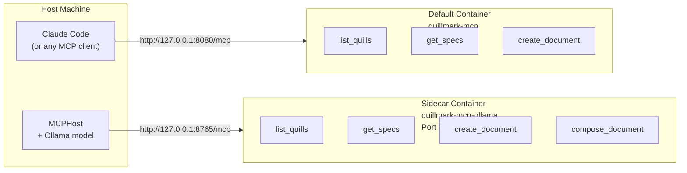
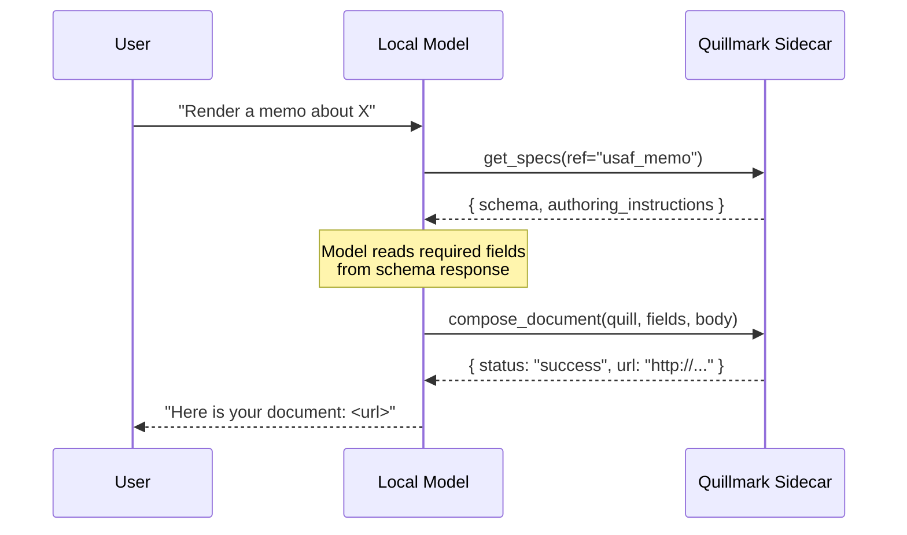

# Ollama Sidecar

Local model support via a dedicated container running the `compose_document` tool surface.

---

## The Problem

Small local models (qwen3:8b, llama3.1:8b, mistral-nemo, hermes3, etc.) cannot reliably produce valid YAML frontmatter as a raw string. They:

- Drop the `---` delimiters or emit mismatched pairs
- Break multi-line strings by omitting YAML block scalars (`|`, `>`)
- Hallucinate field names or nest values incorrectly
- Inject chat-text preamble before the frontmatter block

The `create_document` tool expects a single raw string with well-formed YAML frontmatter followed by a markdown body. Models under ~14B parameters fail this contract often enough to make the flow unusable in practice.

## The Solution

A fourth tool, `compose_document`, accepts **structured JSON** instead of a raw YAML string:

```json
{
  "quill": "usaf_memo",
  "fields": {
    "UNIT_NAME": "673d Air Base Wing",
    "OFFICE_SYMBOL": "673 ABW/CC",
    "DATE": "11 April 2026",
    "MEMORANDUM_FOR": "All Personnel",
    "FROM": "673 ABW/CC",
    "SUBJECT": "Wing Policy Update"
  },
  "body": "1.  This memorandum establishes updated policy guidance.\n\n2.  All units will comply NLT 30 April 2026."
}
```

The server's `composeContent()` function (in `src/primitives/composeYaml.js`) assembles the YAML frontmatter from the `fields` object, injects the `QUILL:` key, adds delimiters, and concatenates the body. The result is fed to the same `createDocument` rendering pipeline used by `create_document` -- there is only one code path, no divergence.

```
compose_document input       createDocument primitive
       |                            ^
       v                            |
  composeContent()  ─────────>  same pipeline
  (JSON → YAML+body string)
```

## Architecture

Two containers, two ports, two tool surfaces. Same Docker image, different environment variables.



### Port 8080 -- Default stack (3 tools)

Managed by `docker compose up` / `install-mcp.sh`. Serves Claude Code, Claude Desktop, Cursor, VS Code, and every other hosted-model client. Exposes exactly three tools:

| Tool | Purpose |
|------|---------|
| `list_quills` | Discover available Quill formats |
| `get_specs` | Read schema + authoring instructions for a Quill |
| `create_document` | Render from raw YAML frontmatter + markdown string |

### Port 8765 -- Ollama sidecar (4 tools)

Managed by `install-ollama.sh`. Launched with `QUILLMARK_LOCAL_MODEL_MODE=1`. Adds one tool on top of the default three:

| Tool | Purpose |
|------|---------|
| `list_quills` | Same as default |
| `get_specs` | Same as default |
| `create_document` | Same as default |
| `compose_document` | Render from structured JSON fields (server assembles YAML) |

### Why separate containers

Claude Code must always see exactly 3 tools. This is a contract stability guarantee -- adding or removing tools from the default endpoint would break existing client registrations and agent loops. The sidecar runs the **same Docker image** with a single env var flip (`QUILLMARK_LOCAL_MODEL_MODE=1`), keeping the two surfaces isolated without any code branching in the image itself.

The gating logic in `QuillmarkMCP.registerTools()`:

```javascript
if (this.localModelMode) {
  this.server.addTool({
    name: 'compose_document',
    // ...
  });
}
```

## install-ollama.sh Automation

The script at `scripts/install-ollama.sh` handles the full setup in order:

1. **Ollama check** -- verifies `ollama` is installed and the daemon is reachable (`ollama list`)
2. **MCPHost install** -- checks for `mcphost`; if missing, installs via: Homebrew, prebuilt binary, or `go install` (in that preference order)
3. **Model selection** -- scans pulled models against a ranked preference list; pulls `qwen2.5:7b` if nothing compatible exists
4. **Sidecar launch** -- `docker run` with `QUILLMARK_LOCAL_MODEL_MODE=1` on port 8765, polls until the MCP endpoint responds to an `initialize` handshake
5. **Config generation** -- calls `node src/bin.js mcphost-config --url <sidecar-url>` to write `~/.mcphost.json`
6. **Launch** -- `exec mcphost -m ollama:<model> --config ~/.mcphost.json --max-steps 30 --system-prompt <tmpfile>`

### Usage

```bash
# Full auto -- detect/install everything, pick best model, launch
./scripts/install-ollama.sh

# Non-interactive (CI / scripted)
./scripts/install-ollama.sh --yes

# Force a specific model
./scripts/install-ollama.sh --model qwen3:8b

# Custom sidecar port
./scripts/install-ollama.sh --port 9765

# Set up everything but don't launch mcphost (print the command instead)
./scripts/install-ollama.sh --no-launch

# Assume sidecar is already running
./scripts/install-ollama.sh --no-server

# Tear down the sidecar
./scripts/install-ollama.sh --stop
```

## MCPHost Config Format

MCPHost (>= 0.33) uses a JSON config with a **non-standard header format**: headers are an **array of strings**, not an object.

```json
{
  "mcpServers": {
    "quillmark": {
      "type": "remote",
      "url": "http://127.0.0.1:8765/mcp"
    }
  }
}
```

With auth token:

```json
{
  "mcpServers": {
    "quillmark": {
      "type": "remote",
      "url": "http://127.0.0.1:8765/mcp",
      "headers": ["Authorization: Bearer sk-..."]
    }
  }
}
```

Key differences from other MCP clients:
- `type` is `"remote"` (not `"http"` or `"streamable-http"`)
- `headers` is `string[]` (not `Record<string, string>`)

The config is generated server-side by `bin.js mcphost-config` so it stays in sync with any schema changes.

## System Prompt Design

The system prompt (written to a temp file and passed via `--system-prompt`) is tuned for weak tool-calling models:

1. **Prefer `compose_document`** -- explicitly tells the model to use structured JSON instead of raw YAML
2. **Forbid chat-text renders** -- instructs the model to never paste the document body as chat output; return only the URL
3. **Retry protocol** -- if `compose_document` returns errors, fix the fields and retry up to 4 times before asking the user
4. **Canonical chain** -- gives a concrete 2-step pattern: `get_specs` then `compose_document`

```
ALWAYS prefer compose_document over create_document. It takes three arguments:
  quill:  the Quill name as a plain string (e.g. "usaf_memo")
  fields: a JSON object of frontmatter fields -- plain JSON, no YAML syntax
  body:   the markdown body of the document (no frontmatter delimiters)
```

Without this prompt, local models routinely attempt to emit the full document as chat text or call `create_document` with malformed YAML.

## Known Model Issues

### qwen3.5 is broken

Ollama's qwen3.5 builds have tool-calling regressions tracked in:
- [ollama/ollama#14493](https://github.com/ollama/ollama/issues/14493)
- [ollama/ollama#14745](https://github.com/ollama/ollama/issues/14745)

Use **qwen3:8b** instead (not qwen3.5).

### Preferred model order

The script ranks models by tool-calling reliability. Earlier entries are preferred:

| Priority | Model family | Notes |
|----------|-------------|-------|
| 1 | `qwen3:*` | Best overall tool calling at the 8B tier |
| 2 | `qwen2.5:*` | Proven reliable, good default pull target |
| 3 | `llama3.3:*` | Strong but larger |
| 4 | `llama3.2:*` | Smaller Llama option |
| 5 | `llama3.1:*` | Widely available |
| 6 | `mistral-nemo` | Often pre-installed |
| 7 | `mistral-small` | Alternative Mistral |
| 8 | `hermes3:*` | Fine-tuned Llama for tool use |
| 9 | `granite3.x:*` | IBM family, capable but less tested |
| 10 | `command-r:*` | Cohere-derived |
| 11 | `phi4` | Microsoft, smaller |
| 12 | `firefunction-v2` | Fireworks-optimized |

General guidance:
- 14B+ parameters give more reliable multi-step tool chains
- Keep temperature at 0.1 or lower to prevent tool-name hallucination
- `--max-steps 30` (the script default) is sufficient for most rendering tasks

## The get_specs / compose_document Chain

The recommended 2-step agent pattern for local models:



**Step 1: `get_specs`** -- the model discovers what fields the Quill requires. Without this call, the model has to guess field names and types, which small models get wrong.

**Step 2: `compose_document`** -- the model fills in the fields as a JSON object and provides the body as a plain string. The server handles all YAML assembly, escaping, and delimiter placement.

This chain is explicit in the system prompt so that even models with weak planning capabilities follow the correct sequence rather than attempting a single `create_document` call with hallucinated YAML.
